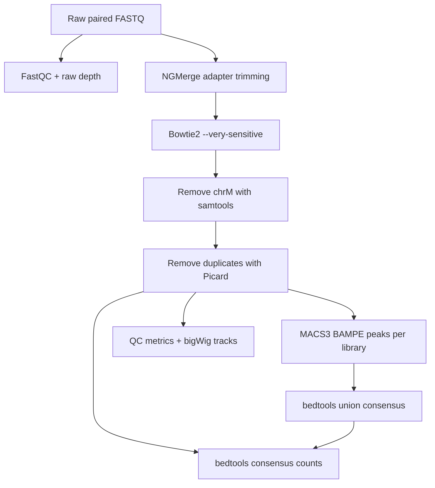

# ATAC-seq Bash preprocessing compendium

**Artifact ID:** ATAC-BASH-DOC-001  
**Scope:** primary Bash workflow from raw paired-end ATAC-seq reads through QC, individual-library peak calling, consensus peak construction, count-matrix generation, and browser tracks.

This compendium is the cleaned, reviewer-facing replacement for the dated and overlapping shell scripts in `AllScripts.zip`. The accepted text of `STAR Methodsv2.4_MM(1).docx` was treated as authoritative. Historical commands were used only to recover implementation detail where they did not conflict with the Methods.

The repository contains no sample-specific `/scratch` paths, fixed array sizes, email addresses, or hard-coded library names. Every sample is defined once in a tab-delimited sample sheet, and every site-specific setting is defined once in a project configuration file.

## Canonical workflow



| Step | Artifact ID | Script | Main output |
| --- | --- | --- | --- |
| Validate | ATAC-BASH-SCR-001 | `scripts/00_check_environment.sh` | observed software versions and input validation |
| Raw QC | ATAC-BASH-SCR-002 | `scripts/01_fastqc.sh` | FastQC reports and raw read depth |
| Adapter trimming | ATAC-BASH-SCR-003 | `scripts/02_ngmerge.sh` | paired NGMerge-trimmed FASTQ files |
| Alignment | ATAC-BASH-SCR-004 | `scripts/03_align_bowtie2.sh` | coordinate-sorted, indexed mm10 BAM |
| Filtering | ATAC-BASH-SCR-005 | `scripts/04_filter_and_deduplicate.sh` | mitochondrial- and duplicate-depleted BAM |
| Peak calling | ATAC-BASH-SCR-006 | `scripts/05_call_peaks_macs3.sh` | one MACS3 narrowPeak file per library |
| Consensus | ATAC-BASH-SCR-007 | `scripts/06_build_consensus_peaks.sh` | merged union consensus BED |
| Counts | ATAC-BASH-SCR-008 | `scripts/07_count_consensus_reads.sh` | peak-by-sample raw count matrix |
| QC metrics | ATAC-BASH-SCR-009 | `scripts/08_collect_qc_metrics.sh` | per-sample metrics, histograms, and combined Table-S3-ready TSV |
| Signal tracks | ATAC-BASH-SCR-010 | `scripts/09_make_bigwig.sh` | normalized bigWig files for browser display |

## Quick start

1. Copy and edit the configuration templates.

   ```bash
   cp config/project_config.example.sh config/project_config.sh
   cp config/samples.example.tsv config/samples.tsv
   ```

2. Set `BOWTIE2_INDEX_PREFIX` and executable or module settings in `config/project_config.sh`. Replace the example rows in `config/samples.tsv` with the paper libraries.

3. Create the pinned software environment, or edit the cluster module identifiers in `config/modules.example.sh`.

   ```bash
   conda env create -f environment.yml
   conda activate atac-paper-bash
   ```

4. Run static validation, then validate the real environment and inputs.

   ```bash
   bash tests/validate_compendium.sh
   bash scripts/00_check_environment.sh config/project_config.sh config/samples.tsv
   ```

5. Run all libraries and cohort-level outputs sequentially.

   ```bash
   bash scripts/run_atac_pipeline.sh config/project_config.sh config/samples.tsv all
   ```

To rerun only one library:

```bash
bash scripts/run_atac_pipeline.sh config/project_config.sh config/samples.tsv sample01
```

After all individually submitted samples finish, create cohort outputs with:

```bash
bash scripts/run_cohort.sh config/project_config.sh config/samples.tsv
```

## SLURM execution

The scheduler templates contain resource requests only; all biological parameters remain in the same configuration files used for local execution.

```bash
mkdir -p results/logs/slurm
sample_count=$(awk -F '\t' 'NR > 1 && $1 != "" {n++} END {print n}' config/samples.tsv)
array_job=$(sbatch --parsable --array="1-${sample_count}" \
  slurm/01_process_samples.sbatch config/project_config.sh config/samples.tsv)
sbatch --dependency="afterok:${array_job}" \
  slurm/02_finalize_cohort.sbatch config/project_config.sh config/samples.tsv
```

## Sample sheet

The first three columns are required and must be tab-delimited:

- `sample_id`: unique, filesystem-safe library identifier.
- `fastq_r1`, `fastq_r2`: absolute paths or paths relative to `PROJECT_ROOT`.
- Remaining metadata columns are retained for the downstream R compendium and do not control Bash processing.

One row must represent one library from one mouse. This matches the Methods statement that one library was generated per mouse and samples were not pooled.

## Reproducibility rules encoded here

- Reported software versions are recorded in `config/software_versions.tsv`, the optional Conda environment, and the module template.
- MACS3 is run independently on each cleaned library in paired-end mode with `-g mm` and `q = 0.05`.
- Bowtie2 uses `--very-sensitive`; the historical `-k 10` multi-alignment branch is not used because it is absent from the Methods.
- The consensus is a union of all q-filtered per-library MACS3 narrowPeak intervals, merged with bedtools. No additional historical q < 1e-10 filter is imposed.
- Consensus counts are produced with `bedtools multicov`, as specified by the Methods and historical standard-count script.
- HMMRATAC, pooled-condition peak calls, STAR/BBMap alignment branches, and featureCounts peak counting are not part of the executable paper workflow.
- MACS3 broad-peak and summit outputs were generated during exploratory batch/modality comparisons. BroadPeak intervals and the standalone summit BED files were not used to build the definitive consensus/count matrix because those exploratory representations showed batch-associated shifts. The final matrix uses the per-library narrowPeak intervals.
- All commands run with Bash strict mode and stop on failed pipelines.

## Confirmed provenance decisions

- `--call-summits` and `-B` are retained because summit and signal outputs were generated. The downstream consensus step explicitly consumes only each library's `_peaks.narrowPeak` file; it does not consume `_summits.bed` or broadPeak output.
- Browser tracks use CPM normalization through deepTools `bamCoverage`.
- FRiP is the fraction of cleaned BAM alignment records overlapping that library's MACS3 peaks, calculated with bedtools.

See [the Methods-to-code map](docs/ATAC-BASH-DOC-002_methods-to-code-map.md) and [historical script audit](docs/ATAC-BASH-DOC-003_historical-script-audit.md) for the full rationale.

For ownership, initial publication, lab permissions, branching, releases, and citation links, use the [GitHub setup and collaboration guide](docs/ATAC-BASH-DOC-006_github-setup-and-collaboration.md).

## Handoff to the R compendium

The principal downstream inputs will be:

- `results/counts/consensus_peak_counts.tsv`
- `config/samples.tsv`
- `results/consensus/consensus_peaks.bed`
- `results/qc/ATACseq_QC_summary.tsv`

The R compendium should consume these files without re-encoding sample identities or preprocessing choices.
